                                                           # Hola Mi nombre es Josué! 👋
## 🚀 Dentro de este proyecto se mostrara la creación con una base de datos y el uso de PROGRAMACIÓN ORIENTADA A OBJETOS Para la creación de una interfaz de un minimarket

# MiniMarket System


     

## Descripción

Este es un sistema de gestión para un miniMarket, desarrollado en Java. A continuación se presentan las principales clases y métodos del sistema.

## Índice

- [Video Guía](#Video)
- [Clase Producto](#clase-producto)
- [Clase Role](#clase-role)
- [Clase Usuario](#clase-usuario)
- [Clase Transaccion](#clase-transaccion)
- [Clase DatabaseConnection](#clase-databaseconnection)
- [Clase login](#clase-login)
- [Clase facturacion](#clase-facturacion)
- [Imágenes del Funcionamiento](#imágenes-del-funcionamiento)
- [Cómo Ejecutar](#cómo-ejecutar)
- [Contribución](#contribución)
- [Licencia](#licencia)

## Clases Principales
### Clase Producto

```java
package miniMarket;

/**
 * Clase Producto que representa un producto en el sistema miniMarket.
 */
public class Producto {
    private String id;
    private String name;
    private int stock;
    private double price;

    /**
     * Constructor de la clase Producto.
     *
     * @param id el identificador del producto
     * @param stock la cantidad en stock del producto
     * @param price el precio del producto
     */
    public Producto(String id, int stock, double price) {
        this.id = id;
        this.name = name;
        this.stock = stock;
        this.price = price;
    }

    /**
     * Obtiene el identificador del producto.
     *
     * @return el identificador del producto
     */
    public String getId() {
        return id;
    }

    /**
     * Obtiene el nombre del producto.
     *
     * @return el nombre del producto
     */
    public String getName() {
        return name;
    }

    /**
     * Obtiene la cantidad en stock del producto.
     *
     * @return la cantidad en stock del producto
     */
    public int getStock() {
        return stock;
    }

    /**
     * Obtiene el precio del producto.
     *
     * @return el precio del producto
     */
    public double getPrice() {
        return price;
    }

    /**
     * Reduce la cantidad en stock del producto.
     *
     * @param quantity la cantidad a reducir del stock
     */
    public void reduceStock(int quantity) {
        this.stock -= quantity;
    }

    /**
     * Incrementa la cantidad en stock del producto.
     *
     * @param quantity la cantidad a incrementar del stock
     */
    public void increaseStock(int quantity) {
        this.stock += quantity;
    }
}
```

### Clase Role

```java
package miniMarket.interfaz.clases;

/**
 * Clase Role que representa un rol de usuario en el sistema miniMarket.
 */
public class Role {
    int idRol;
    String nombreRol;

    /**
     * Constructor por defecto de la clase Role.
     */
    public Role() {
    }

    /**
     * Constructor de la clase Role con parámetros.
     *
     * @param idRol el identificador del rol
     * @param nombreRol el nombre del rol
     */
    public Role(int idRol, String nombreRol) {
        this.idRol = idRol;
        this.nombreRol = nombreRol;
    }

    /**
     * Obtiene el identificador del rol.
     *
     * @return el identificador del rol
     */
    public int getIdRol() {
        return idRol;
    }

    /**
     * Establece el identificador del rol.
     *
     * @param idRol el nuevo identificador del rol
     */
    public void setIdRol(int idRol) {
        this.idRol = idRol;
    }

    /**
     * Obtiene el nombre del rol.
     *
     * @return el nombre del rol
     */
    public String getNombreRol() {
        return nombreRol;
    }

    /**
     * Establece el nombre del rol.
     *
     * @param nombreRol el nuevo nombre del rol
     */
    public void setNombreRol(String nombreRol) {
        this.nombreRol = nombreRol;
    }
}
```

### Clase Usuario

```java
package miniMarket.interfaz.clases;

/**
 * Clase Usuario que representa un usuario en el sistema miniMarket.
 */
public class Usuario {
    private String id;
    private String username;
    private String password;
    private String role;

    /**
     * Constructor de la clase Usuario.
     *
     * @param id el identificador del usuario
     * @param username el nombre de usuario
     * @param password la contraseña del usuario
     * @param role el rol del usuario
     */
    public Usuario(String id, String username, String password, String role) {
        this.id = id;
        this.username = username;
        this.password = password;
        this.role = role;
    }

    /**
     * Obtiene el identificador del usuario.
     *
     * @return el identificador del usuario
     */
    public String getId() {
        return id;
    }

    /**
     * Obtiene el nombre de usuario.
     *
     * @return el nombre de usuario
     */
    public String getUsername() {
        return username;
    }

    /**
     * Obtiene la contraseña del usuario.
     *
     * @return la contraseña del usuario
     */
    public String getPassword() {
        return password;
    }

    /**
     * Obtiene el rol del usuario.
     *
     * @return el rol del usuario
     */
    public String getRole() {
        return role;
    }
}
```

### Clase Transaccion

```java
package miniMarket.interfaz.clases;

import java.util.Date;

/**
 * Clase Transaccion que representa una transacción en el sistema miniMarket.
 */
public class Transaccion {
    private final String id;
    private Date date;
    private Usuario cashier;
    private Producto product;
    private int quantity;
    private double totalPrice;

    /**
     * Constructor de la clase Transaccion.
     *
     * @param id el identificador de la transacción
     * @param date la fecha de la transacción
     * @param cashier el cajero que realizó la transacción
     * @param product el producto vendido en la transacción
     * @param quantity la cantidad de producto vendido
     * @param totalPrice el precio total de la transacción
     */
    public Transaccion(String id, Date date, Usuario cashier, Producto product, int quantity, double totalPrice) {
        this.id = id;
        this.date = date;
        this.cashier = cashier;
        this.product = product;
        this.quantity = quantity;
        this.totalPrice = totalPrice;
    }

    /**
     * Obtiene el identificador de la transacción.
     *
     * @return el identificador de la transacción
     */
    public String getId() {
        return id;
    }

    /**
     * Obtiene la fecha de la transacción.
     *
     * @return la fecha de la transacción
     */
    public Date getDate() {
        return date;
    }

    /**
     * Obtiene el cajero que realizó la transacción.
     *
     * @return el cajero que realizó la transacción
     */
    public Usuario getCashier() {
        return cashier;
    }

    /**
     * Obtiene el producto vendido en la transacción.
     *
     * @return el producto vendido en la transacción
     */
    public Producto getProduct() {
        return product;
    }

    /**
     * Obtiene la cantidad de producto vendido.
     *
     * @return la cantidad de producto vendido
     */
    public int getQuantity() {
        return quantity;
    }

    /**
     * Obtiene el precio total de la transacción.
     *
     * @return el precio total de la transacción
     */
    public double getTotalPrice() {
        return totalPrice;
    }
}
```

### Clase DatabaseConnection

```java
package miniMarket.interfaz.clases;

import java.sql.Connection;
import java.sql.DriverManager;
import java.sql.SQLException;

/**
 * Clase DatabaseConnection que maneja la conexión a la base de datos del sistema miniMarket.
 */
public class DatabaseConnection {
    private static final String URL = "jdbc:mysql://localhost:3306/minimarket";
    private static final String USER = "root";
    private static final String PASSWORD = "";

    /**
     * Obtiene una conexión a la base de datos.
     *
     * @return una conexión a la base de datos
     * @throws SQLException si ocurre un error al conectar a la base de datos
     */
    public static Connection getConnection() throws SQLException {
        return DriverManager.getConnection(URL, USER, PASSWORD);
    }
}
```

### Clase login

```java
package miniMarket.interfaz;

import miniMarket.interfaz.clases.DatabaseConnection;
import miniMarket.interfaz.clases.Usuario;
import miniMarket.interfaz.admin.actividad;
import javax.swing.*;
import java.awt.event.ActionEvent;
import java.awt.event

.ActionListener;
import java.sql.Connection;
import java.sql.PreparedStatement;
import java.sql.ResultSet;
import java.sql.SQLException;

/**
 * Clase login que representa la ventana de inicio de sesión para los usuarios del sistema miniMarket.
 */
public class login extends JFrame {
    public JPanel mainPanel5;
    private JPasswordField contra;
    private JTextField usuario;
    private JRadioButton mostrarContraseñaRadioButton;
    private JButton loginButton;
    private JLabel img1;
    private JLabel img2;
    private JLabel mensaje;
    private JComboBox<String> comboBox1;
    private JButton Salir;

    public login() {
        // Inicializar el comboBox con las opciones requeridas
        comboBox1.addItem(" ");
        comboBox1.addItem("Cajero");
        comboBox1.addItem("Admin");

        ImageIcon icon = new ImageIcon("src/channels4_profile.jpg");
        icon = new ImageIcon(icon.getImage().getScaledInstance(75, 75, java.awt.Image.SCALE_SMOOTH));
        img1.setIcon(icon);

        icon = new ImageIcon("src/channels4_profile.jpg");
        icon = new ImageIcon(icon.getImage().getScaledInstance(75, 75, java.awt.Image.SCALE_SMOOTH));
        img2.setIcon(icon);

        loginButton.addActionListener(new ActionListener() {
            @Override
            public void actionPerformed(ActionEvent e) {
                String username = usuario.getText();
                String password = new String(contra.getPassword());
                String role = (String) comboBox1.getSelectedItem();

                Usuario user = authenticate(username, password, role);
                if (user != null) {
                    if (user.getRole().equals("Cajero")) {
                        JFrame frame = new JFrame("Transaccion");
                        frame.setContentPane(new transaccion(Integer.parseInt(user.getId())).getMainPanel6());
                        frame.setDefaultCloseOperation(JFrame.EXIT_ON_CLOSE);
                        frame.pack();
                        frame.setLocationRelativeTo(null);
                        frame.setVisible(true);

                        JFrame transaccion_frame = (JFrame) SwingUtilities.getWindowAncestor(mainPanel5);
                        transaccion_frame.dispose();
                    } else if (user.getRole().equals("Admin")) {
                        new actividad().setVisible(true);
                    }
                    // Cerrar la ventana actual
                    JFrame login_frame = (JFrame) SwingUtilities.getWindowAncestor(mainPanel5);
                    login_frame.dispose();
                } else {
                    JOptionPane.showMessageDialog(login.this, "Credenciales incorrectas.");
                }
            }
        });

        mostrarContraseñaRadioButton.addActionListener(new ActionListener() {
            @Override
            public void actionPerformed(ActionEvent e) {
                if (mostrarContraseñaRadioButton.isSelected()) {
                    contra.setEchoChar((char) 0);
                } else {
                    contra.setEchoChar('•');
                }
            }
        });

        Salir.addActionListener(new ActionListener() {
            @Override
            public void actionPerformed(ActionEvent e) {
                JFrame facturacion_frame = (JFrame) SwingUtilities.getWindowAncestor(mainPanel5);
                facturacion_frame.dispose();
            }
        });
    }

    private Usuario authenticate(String username, String password, String role) {
        String query = "SELECT * FROM usuarios WHERE username = ? AND password = ? AND role = ?";
        try (Connection conn = DatabaseConnection.getConnection();
             PreparedStatement stmt = conn.prepareStatement(query)) {

            stmt.setString(1, username);
            stmt.setString(2, password);
            stmt.setString(3, role);
            ResultSet rs = stmt.executeQuery();

            if (rs.next()) {
                return new Usuario(rs.getString("id"), rs.getString("username"), rs.getString("password"), rs.getString("role"));
            }
        } catch (SQLException e) {
            e.printStackTrace();
        }
        return null;
    }

    public static void main(String[] args) {
        SwingUtilities.invokeLater(() -> {
            login loginFrame = new login();
            loginFrame.setContentPane(loginFrame.mainPanel5);
            loginFrame.setDefaultCloseOperation(JFrame.EXIT_ON_CLOSE);
            loginFrame.pack();
            loginFrame.setLocationRelativeTo(null);
            loginFrame.setVisible(true);
        });
    }
}
```

### Clase facturacion

```java
package miniMarket.interfaz;

import miniMarket.interfaz.clases.DatabaseConnection;
import miniMarket.interfaz.clases.Usuario;
import javax.swing.*;
import java.awt.*;
import java.util.ArrayList;
import java.awt.event.ActionEvent;
import java.awt.event.ActionListener;
import java.io.FileNotFoundException;
import java.io.FileOutputStream;
import java.io.IOException;
import java.sql.Connection;
import java.sql.PreparedStatement;
import java.sql.SQLException;
import java.util.List;
import java.util.Properties;
import java.util.UUID;
import javax.mail.*;
import javax.mail.internet.*;
import javax.activation.*;
import com.itextpdf.text.*;
import com.itextpdf.text.pdf.*;
import javax.xml.parsers.DocumentBuilder;
import javax.xml.parsers.DocumentBuilderFactory;
import javax.xml.parsers.ParserConfigurationException;
import javax.xml.transform.*;
import javax.xml.transform.dom.DOMSource;
import javax.xml.transform.stream.StreamResult;

/**
 * Clase facturacion que maneja la generación y envío de facturas en el sistema miniMarket.
 */
public class facturacion extends JFrame {
    public JPanel mainPanel4;
    private JTextField usuario;
    private JLabel img1;
    private JLabel mensaje;
    private JButton notaVenta;
    private JTextField cedula;
    private JTextField correo;
    private JTextField fecha;
    private JTextField direccion;
    private JComboBox<String> comboBox1;
    private JLabel img2;
    private JButton volver;
    private Usuario cashier;
    private List<String> productosVendidos;
    private double precioTotal;

    public facturacion(List<String> productosVendidos, double precioTotal) {
        this.productosVendidos = productosVendidos;
        this.precioTotal = precioTotal;

        ImageIcon icon = new ImageIcon("src/channels4_profile.jpg");
        icon = new ImageIcon(icon.getImage().getScaledInstance(75, 75, java.awt.Image.SCALE_SMOOTH));
        img1.setIcon(icon);

        icon = new ImageIcon("src/channels4_profile.jpg");
        icon = new ImageIcon(icon.getImage().getScaledInstance(75, 75, java.awt.Image.SCALE_SMOOTH));
        img2.setIcon(icon);

        notaVenta.addActionListener(new ActionListener() {
            @Override
            public void actionPerformed(ActionEvent e) {
                if (validarCampos()) {
                    try {
                        double total = precioTotal;
                        String metodoPago = (String) comboBox1.getSelectedItem();
                        if (metodoPago.equals("Tarjeta")) {
                            total *= 1.10; // Añadir 10% al total
                        }
                        String pdfPath = generarPDF(total);
                        String xmlPath = generarXML();
                        boolean emailSent = enviarCorreo(correo.getText(), pdfPath, xmlPath);
                        guardarEnBaseDeDatos(pdfPath, xmlPath);

                        if (emailSent) {
                            JOptionPane.showMessageDialog(facturacion.this, "El correo se ha enviado correctamente.");
                        } else {
                            JOptionPane.showMessageDialog(facturacion.this, "No se ha podido enviar la información, asegúrese de que se insertó bien el correo electrónico.");
                        }
                    } catch (Exception ex) {
                        ex.printStackTrace();
                    }
                } else {
                    JOptionPane.showMessageDialog(facturacion.this, "Complete todos los campos para la facturación.");
                }
            }
        });

        setContentPane(mainPanel4);
        setDefaultCloseOperation(JFrame.EXIT_ON_CLOSE);
        pack();
        setLocationRelativeTo(null);

        volver.addActionListener(new ActionListener() {
            @Override
            public void actionPerformed(ActionEvent e) {
                JFrame frame = new JFrame("Actividades");
                frame.setContentPane(new login().mainPanel5);
                frame.setDefaultCloseOperation(JFrame.EXIT_ON_CLOSE);
                frame.pack();
                frame.setLocationRelativeTo(null);
                frame.setVisible(true);

                JFrame facturacion_frame = (JFrame) SwingUtilities.getWindowAncestor(mainPanel4);
                facturacion_frame.dispose();
            }
        });
    }

    private boolean validarCampos() {
        if (usuario.getText().isEmpty() || cedula.getText().isEmpty() || correo.getText().isEmpty() ||
                fecha.getText().isEmpty() || direccion.getText().isEmpty()) {
            return false;
        } else {
            if (!cedula.getText().matches("\\d{10}")) {
                JOptionPane.showMessageDialog(this, "La cédula debe tener 10 dígitos.");
                cedula.setBorder(BorderFactory.createLineBorder(Color.RED));
                return false;
            }
            if (!correo.getText().matches("^[A-Za-z0-9+_.-]+@[A-Za-z0-9.-]+$")) {
                JOptionPane.showMessageDialog(this, "El correo electrónico no tiene un formato válido.");
                correo.setBorder(BorderFactory.createLineBorder(Color.RED));
                return false;
            }
            if (comboBox1.getSelectedItem() == null || comboBox1.getSelectedItem().toString().isEmpty()) {
                JOptionPane.showMessageDialog(this, "Debe seleccionar un método de pago.");
                comboBox1.setBorder(BorderFactory.createLineBorder(Color.RED));
                return false;
            }
            return true;
        }
    }

    /**
     * Genera un archivo PDF de la factura.
     *
     * @param total el total de la factura
     * @return la ruta del archivo PDF generado
     * @throws DocumentException si ocurre un error al crear el documento PDF
     * @throws IOException si ocurre un error al escribir el archivo PDF
     */
    private String generarPDF(double total) throws DocumentException, IOException {
        Document document

 = new Document();
        String fileName = "src/facturas/Factura_" + UUID.randomUUID() + ".pdf";
        PdfWriter.getInstance(document, new FileOutputStream(fileName));
        document.open();

        document.add(new Paragraph("MiniMarket SafJos", FontFactory.getFont(FontFactory.HELVETICA_BOLD, 12)));
        document.add(new Paragraph("Dirección Matriz: Ladrón de Guevara E11-253 y Andalucía", FontFactory.getFont(FontFactory.HELVETICA, 10)));
        document.add(new Paragraph("Contribuyente especial Nro: 1308", FontFactory.getFont(FontFactory.HELVETICA, 10)));
        document.add(new Paragraph("Obligado a llevar contabilidad: Sí", FontFactory.getFont(FontFactory.HELVETICA, 10)));

        // Espacio
        document.add(new Paragraph("\n"));

        document.add(new Paragraph("Razón Social/Nombres y Apellidos: " + usuario.getText(), FontFactory.getFont(FontFactory.HELVETICA_BOLD, 10)));
        document.add(new Paragraph("Cédula/RUC: " + cedula.getText(), FontFactory.getFont(FontFactory.HELVETICA, 10)));
        document.add(new Paragraph("Fecha: " + fecha.getText(), FontFactory.getFont(FontFactory.HELVETICA, 10)));
        document.add(new Paragraph("Correo Electrónico: " + correo.getText(), FontFactory.getFont(FontFactory.HELVETICA, 10)));
        document.add(new Paragraph("Dirección: " + direccion.getText(), FontFactory.getFont(FontFactory.HELVETICA, 10)));
        document.add(new Paragraph("Forma de Pago: " + comboBox1.getSelectedItem().toString(), FontFactory.getFont(FontFactory.HELVETICA, 10)));

        // Espacio
        document.add(new Paragraph("\n"));

        PdfPTable table = new PdfPTable(5);
        table.setWidthPercentage(100);
        table.setWidths(new float[]{2, 3, 1, 2, 2});

        addTableHeader(table, "Código");
        addTableHeader(table, "Descripción");
        addTableHeader(table, "Cantidad");
        addTableHeader(table, "Precio Unitario");
        addTableHeader(table, "Precio Total");

        for (String producto : productosVendidos) {
            String[] parts = producto.split(": ");
            if (parts.length == 3) {
                String codigo = parts[0];
                String cantidad = parts[1];
                String precioUnitario = parts[2].replace(",", "."); // Reemplazar coma por punto
                float precioTotal = Float.parseFloat(cantidad) * Float.parseFloat(precioUnitario);

                addTableCell(table, codigo);
                addTableCell(table, codigo);
                addTableCell(table, cantidad);
                addTableCell(table, precioUnitario);
                addTableCell(table, String.format("%.2f", precioTotal));
            } else {
                System.err.println("Formato de producto incorrecto: " + producto);
            }
        }

        document.add(table);

        document.add(new Paragraph("Valor Total: $" + String.format("%.2f", total), FontFactory.getFont(FontFactory.HELVETICA_BOLD, 12)));

        document.close();
        return fileName;
    }

    private void addTableHeader(PdfPTable table, String headerTitle) {
        PdfPCell header = new PdfPCell();
        header.setBorderWidth(2);
        header.setPhrase(new Phrase(headerTitle));
        table.addCell(header);
    }

    private void addTableCell(PdfPTable table, String cellValue) {
        PdfPCell cell = new PdfPCell();
        cell.setPhrase(new Phrase(cellValue));
        table.addCell(cell);
    }

    /**
     * Genera un archivo XML de la factura.
     *
     * @return la ruta del archivo XML generado
     * @throws ParserConfigurationException si ocurre un error al crear el parser XML
     * @throws TransformerException si ocurre un error al transformar el documento XML
     * @throws FileNotFoundException si ocurre un error al crear el archivo XML
     */
    private String generarXML() throws ParserConfigurationException, TransformerException, FileNotFoundException {
        DocumentBuilderFactory docFactory = DocumentBuilderFactory.newInstance();
        DocumentBuilder docBuilder = docFactory.newDocumentBuilder();
        org.w3c.dom.Document doc = docBuilder.newDocument();
        org.w3c.dom.Element rootElement = doc.createElement("factura");
        doc.appendChild(rootElement);

        org.w3c.dom.Element nombre = doc.createElement("nombre");
        nombre.appendChild(doc.createTextNode(usuario.getText()));
        rootElement.appendChild(nombre);

        org.w3c.dom.Element direccionElem = doc.createElement("direccion");
        direccionElem.appendChild(doc.createTextNode(direccion.getText()));
        rootElement.appendChild(direccionElem);

        org.w3c.dom.Element cedulaElem = doc.createElement("cedula");
        cedulaElem.appendChild(doc.createTextNode(cedula.getText()));
        rootElement.appendChild(cedulaElem);

        org.w3c.dom.Element correoElem = doc.createElement("correo");
        correoElem.appendChild(doc.createTextNode(correo.getText()));
        rootElement.appendChild(correoElem);

        org.w3c.dom.Element fechaElem = doc.createElement("fecha");
        fechaElem.appendChild(doc.createTextNode(fecha.getText()));
        rootElement.appendChild(fechaElem);

        org.w3c.dom.Element productosElem = doc.createElement("productos");
        for (String producto : productosVendidos) {
            org.w3c.dom.Element productoElem = doc.createElement("producto");
            productoElem.appendChild(doc.createTextNode(producto));
            productosElem.appendChild(productoElem);
        }
        rootElement.appendChild(productosElem);

        org.w3c.dom.Element totalElem = doc.createElement("total");
        totalElem.appendChild(doc.createTextNode(String.valueOf(precioTotal)));
        rootElement.appendChild(totalElem);

        TransformerFactory transformerFactory = TransformerFactory.newInstance();
        Transformer transformer = transformerFactory.newTransformer();
        DOMSource source = new DOMSource(doc);
        String fileName = "src/facturas/Factura_" + UUID.randomUUID() + ".xml";
        StreamResult result = new StreamResult(new FileOutputStream(fileName));

        transformer.transform(source, result);
        return fileName;
    }

    private boolean enviarCorreo(String destinatario, String pdfPath, String xmlPath) {
        String remitente = "guerralovatojosue@hotmail.com";
        String clave = "swordart12";  // Cambia esto a tu clave de Hotmail
        String asunto = "Factura de compra";
        String mensaje = "Agradecemos su compra en miniMarket SafJos,\nAdjunto encontrará la factura de su compra.\n esperamos tenerlo de vuelta por nuestras instalaciones 😊👍🎇";

        Properties props = new Properties();
        props.put("mail.smtp.host", "smtp.office365.com");
        props.put("mail.smtp.user", remitente);
        props.put("mail.smtp.clave", clave);
        props.put("mail.smtp.auth", "true");
        props.put("mail.smtp.starttls.enable", "true");
        props.put("mail.smtp.port", "587");

        Session session = Session.getDefaultInstance(props);
        MimeMessage message = new MimeMessage(session);

        try {
            message.setFrom(new InternetAddress(remitente));
            message.addRecipient(Message.RecipientType.TO, new InternetAddress(destinatario));
            message.setSubject(asunto);
            BodyPart texto = new MimeBodyPart();
            texto.setText(mensaje);
            BodyPart adjuntoPDF = new MimeBodyPart();
            adjuntoPDF.setDataHandler(new DataHandler(new FileDataSource(pdfPath)));
            adjuntoPDF.setFileName("Factura.pdf");
            BodyPart adjuntoXML = new MimeBodyPart();
            adjuntoXML.setDataHandler(new DataHandler(new FileDataSource(xmlPath)));
            adjuntoXML.setFileName("Factura.xml");
            MimeMultipart multiParte = new MimeMultipart();
            multiParte.addBodyPart(texto);
            multiParte.addBodyPart(adjuntoPDF);
            multiParte.addBodyPart(adjuntoXML);
            message.setContent(multiParte);
            Transport transport = session.getTransport("smtp");
            transport.connect("smtp.office365.com", remitente, clave);
            transport.sendMessage(message, message.getAllRecipients());
            transport.close();
            return true;
        } catch (MessagingException me) {
            me.printStackTrace();
            return false;
        }
    }

    private void guardarEnBaseDeDatos(String pdfPath, String xmlPath) {
        String query = "INSERT INTO facturas (usuario, cedula, correo, fecha, direccion, metodo_pago, pdf_path, xml_path) VALUES (?, ?, ?, ?, ?, ?, ?, ?)";
        try (Connection conn = DatabaseConnection.getConnection();
             PreparedStatement stmt = conn.prepareStatement(query)) {

            stmt.setString(1, usuario.getText());
            stmt.setString(2, cedula.getText());
            stmt.setString(3, correo.getText());
            stmt.setString(4, fecha.getText());
            stmt.setString(5, direccion.getText());
            stmt.setString(6, (String) comboBox1.getSelectedItem());
            stmt.setString(7, pdfPath);
            stmt.setString(8, xmlPath);
            stmt.executeUpdate();
        } catch (SQLException e) {
            e.printStackTrace();
        }
    }

    public static void main(String[] args) {
        SwingUtilities.invokeLater(() -> {
            facturacion frame = new facturacion(new ArrayList<>(), 0.0);
            frame.setContentPane(frame.mainPanel4);
            frame.setDefaultCloseOperation(JFrame

.EXIT_ON_CLOSE);
            frame.pack();
            frame.setLocationRelativeTo(null);
            frame.setVisible(true);
        });
    }
}
```

## Imágenes del Funcionamiento

### Pantalla de Login

<div style="display: flex; justify-content: center;">
    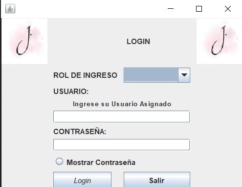
</div>

### Pantalla de Actividad Admin

<div style="display: flex; justify-content: center;">
    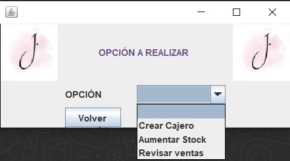
</div>

### Pantalla de Añadir Stock

<div style="display: flex; justify-content: center;">
    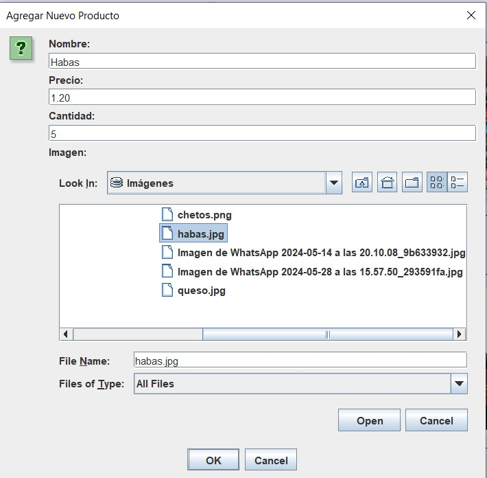
</div>

### Pantalla de Compra

<div style="display: flex; justify-content: center;">
    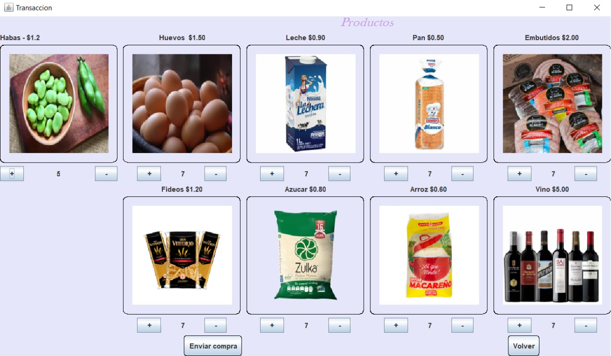
</div>

### Compra Realizada

<div style="display: flex; justify-content: center;">
    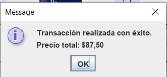
</div>

### Confirmación

<div style="display: flex; justify-content: center;">
    
</div>

### Datos de Factura

<div style="display: flex; justify-content: center;">
    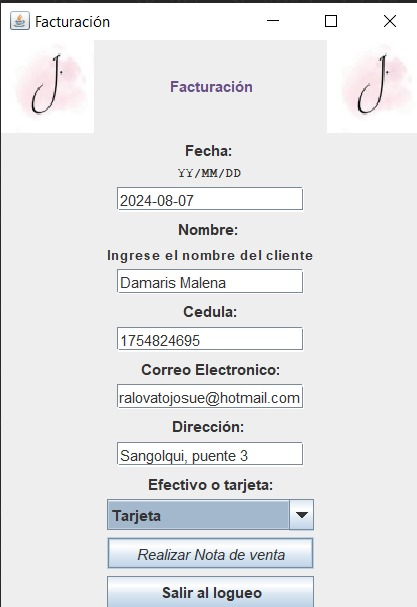
</div>

### Envío de Credenciales

<div style="display: flex; justify-content: center;">
    
</div>

### Login de Admin

<div style="display: flex; justify-content: center;">
    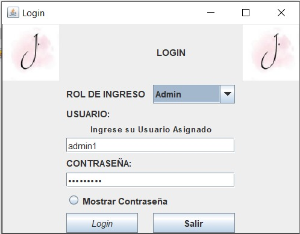
</div>

### Logueo de Cajero

<div style="display: flex; justify-content: center;">
    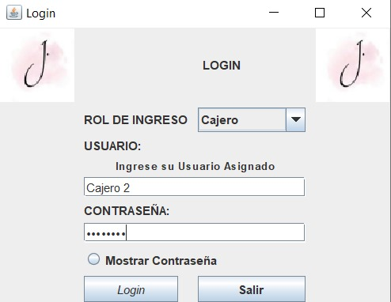
</div>

### Mensaje de Correo

<div style="display: flex; justify-content: center;">
    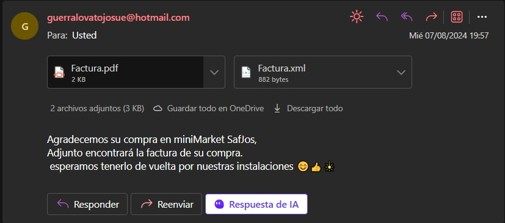
</div>

### PDF

<div style="display: flex; justify-content: center;">
    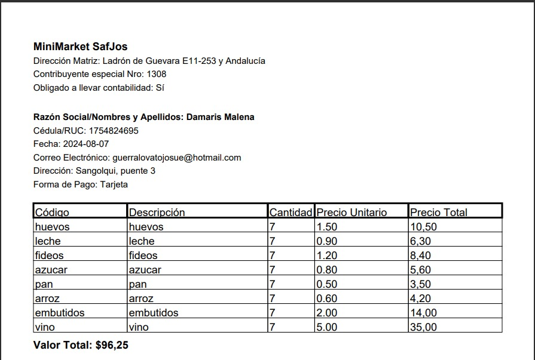
</div>

### Recepción de Correo

<div style="display: flex; justify-content: center;">
    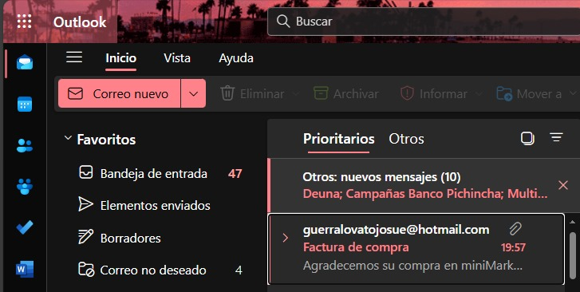
</div>

### Revisión de Ventas

<div style="display: flex; justify-content: center;">
    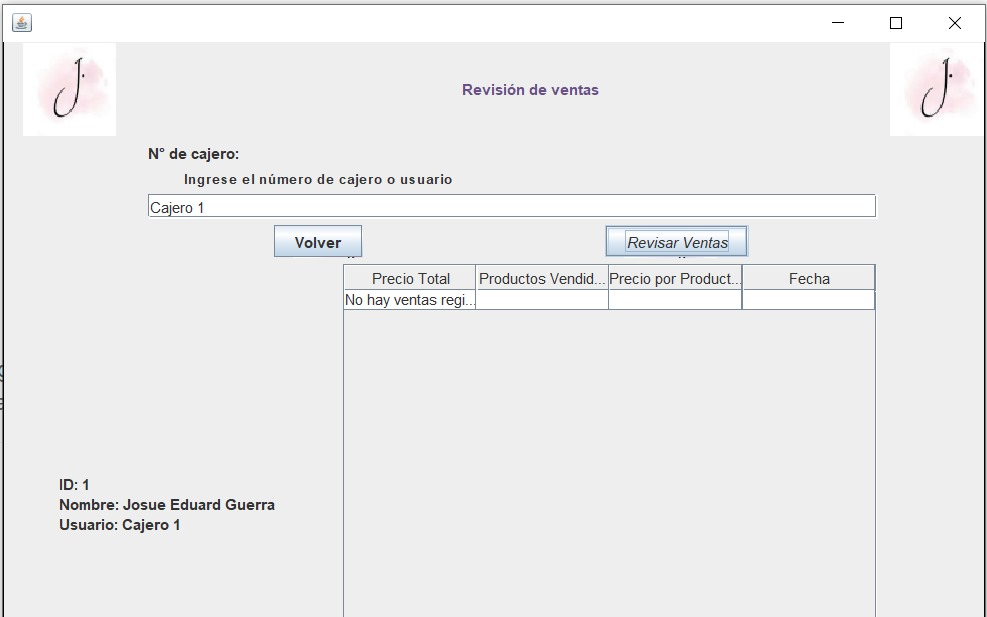
</div>

### Stock Actualizado

<div style="display: flex; justify-content: center;">
    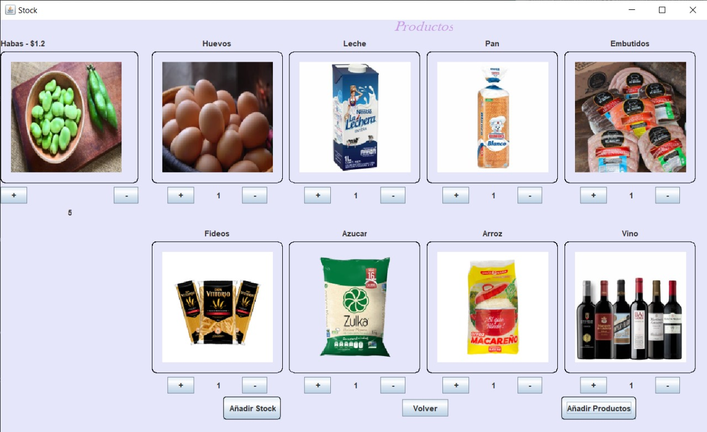
</div>

### XML

<div style="display: flex; justify-content: center;">
    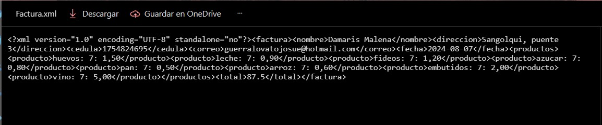
</div>

## Cómo Ejecutar

1. Clona el repositorio:
    ```bash
    git clone https://github.com/tu_usuario/miniMarket.git
    ```

2. Importa el proyecto en tu IDE preferido (por ejemplo, IntelliJ IDEA).

3. Asegúrate de tener una base de datos MySQL configurada con las credenciales adecuadas en la clase `DatabaseConnection`.

4. Ejecuta la aplicación desde la clase `login`.

## Contribución

Si deseas contribuir a este proyecto, por favor sigue los siguientes pasos:

1. Haz un fork del repositorio.
2. Crea una nueva rama (`git checkout -b feature/nueva-funcionalidad`).
3. Realiza tus cambios y commitea (`git commit -am 'Añadir nueva funcionalidad'`).
4. Sube tu rama (`git push origin feature/nueva-funcionalidad`).
5. Abre un Pull Request.

## Licencia

Este proyecto está licenciado bajo la Licencia MIT. Para más detalles, consulta el archivo [LICENSE](LICENSE).
```
